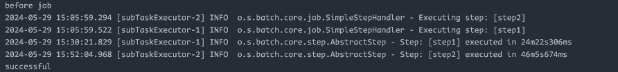
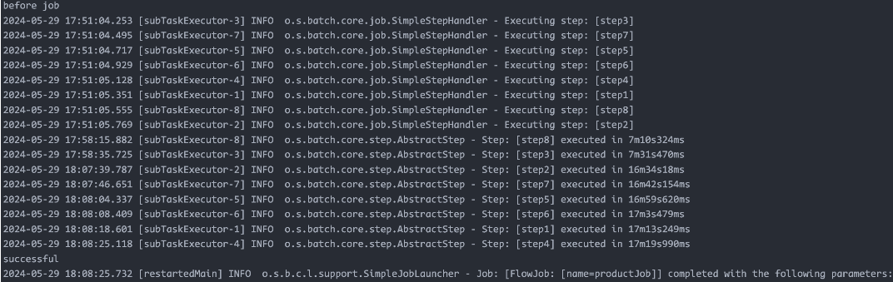

# aw07 - Big data for MicroPos

详细的过程记录[链接](https://pxe09in4bw.feishu.cn/docx/WzcWdmW37oLl2SxQPWpcuxhsnfg#AEGFdCnIWovYbExYMMjcYlPlnhg)

### 数据表设计

-   表中存在海量的数据，因此需要添加索引来提高查找效率，例如商品的 `asin` 属性就需要建立索引
-   分库分表，对于图片 url，考虑单独分开一个表存储，原因是 url 可能会失效，或者被替换，同时为了服务于 url 测试模块，单独分出一个表可以快速获得数据库中的 url
-   注意表之间的关联，体现在 product_id/review_id 与之对应的 image 表存在关联，user 表与 review 表又存在关联，设计上就需要建立外键约束

schema 如下

```sql
create table review (
    id bigint AUTO_INCREMENT not null primary key,
    rating double,
    title text,
    text text,
    asin char(10),
    parent_asin char(20),
    user_id char(30),
    timestamp bigint,
    helpful_vote int,
    index (asin, user_id)
);
create table product (
    id bigint AUTO_INCREMENT not null primary key,
    main_category text,
    title text,
    average_rating double,
    features text default null,
    description text default null,
    price double,
    store text,
    details json default null,
    parent_asin char(10),
    index (parent_asin)
);
create table review_image (
    review_id bigint,
    url text,
    info varchar(255),
    foreign key (review_id) references review(id),
    index (review_id)
);
create table product_image (
    product_id bigint,
    url text,
    info varchar(255),
    foreign key (product_id) references product(id),
    index (product_id)
);
create table user (
    user_id char(30),
    review_id bigint,
    foreign key (review_id) references review(id)
);
drop table if exists bad_image;
create table bad_image (
    url text
);
```

### 额外处理

-   主要考虑测试 url 是否有效，通过 spring batch 完成，实现上是使用 jsoup 库发送 http 请求，判断响应状态码
-   由于本次作业数据量大，且考虑到实际生产环境，采用了**云服务器**作为 mysql 数据库的服务器，通过网络请求写数据到数据库中

### Batch 配置

在这部分花费了较多的精力，测试了不同的配置方式在执行速度上的区别，总结起来需要考虑的点如下

-   线程安全，当使用线程池来并发执行任务时，普通的 JsonItemReader 是线程不安全的，根据 Spring 文档，需要用 SynchronizedItemStreamReader 进行封装，否则会出现读取异常；而对于 writer 来说，因为不涉及并发数据的修改，因此可以用普通的 ItemWriter 来提高速度
-   使用 flow 来并行执行任务，因为读取 product 数据和读取 review 数据是相互独立的，在运用 split flow 的情况下会比普通的 step 组合执行要快
-   配置 ThreadPoolTaskExecutor 时，核心线程池大小设置为 cpu 核数较合适
-   配置 jvm 参数，加大堆内存，减少频繁的 GC
-   由于我使用了 JsonItemReader 来读取 json 数据，因此需要把原始的 jsonl 数据转换为 json 数组，这一步也比较耗时间，本来通过 jq 工具帮我转换，但是数据集存在 unicode 字符，导致转换后变成 utf16 编码，因此只能自己写 python 程序来完成转换
-   综上分析可知，性能的瓶颈在于 reader，因为是串行的，这时就需要将大文件分片来提高速度，这一步也需要通过编写 python 程序完成

下面给出一些执行结果截图（对于同样的数据集，数据量在 20w 左右）：

-   串行执行，接近 2h
    -   
-   并发+flow，46min
    -   
-   文件分片，17min
    -   

---

[Amazon Review Data (2023)](https://amazon-reviews-2023.github.io/) 是一个包含从1996年到2023年间Amazon商品、用户和评价数据的海量数据集，概况如下：

|评论| 用户 | 商品 |
|--| -- | -- |
|571.54M|54.51M|48.19M|


请完成以下任务

- 下载至少两大类商品的元数据(metadata)和评论数据(reviews)；
  - 在云盘中提供了已下载的部分数据(https://box.nju.edu.cn/d/3e125ec5ca2f476db822/)
- 请使用spring batch将原始格式的数据分别转为User/Product/Review三类对象，包括其间关联关系，并将数据保存到数据库；
  - 请额外考虑一些复杂的处理，比如将英文翻译为中文、测试图片url是否有效等；
- 请将数据库整合进你的MicroPOS（微服务版本的POS系统）并对系统进行相应改造，要求系统使用者可以通过浏览器中的web前端看到商品列表、点击商品后可以看到商品详情和商品相关的评论列表；
- 编写README.md，着重介绍你做了那些处理步骤以及如何使得数据转化处理过程尽量快速。
